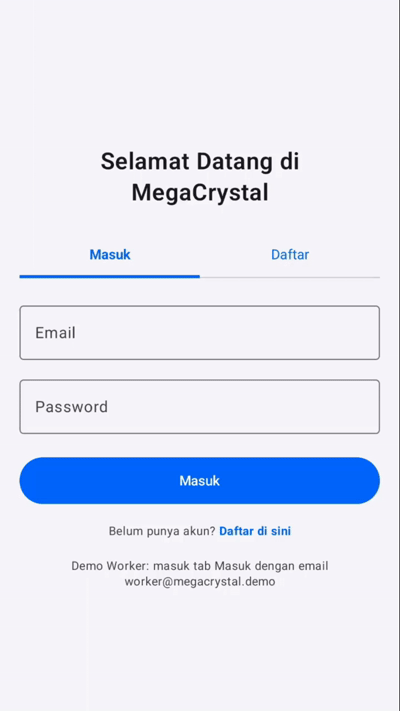

# 🧊 MegaCrystal - Sistem Distribusi Es Kristal

> **Distribusi Lancar, Es Tetap Segar.**
> 
> Proyek Aplikasi Mobile Terintegrasi untuk Manajemen Pemesanan dan Pengiriman Es Kristal dengan Integrasi Pembayaran Digital (QRIS).

---

## 📌 Latar Belakang
Bisnis distribusi es kristal memiliki tantangan unik: produk mudah mencair dan pelanggan (restoran, kafe, warung) membutuhkan pasokan yang cepat dan tepat. Selama ini, banyak distributor masih mengandalkan pencatatan manual via telepon atau aplikasi pesan instan. Sistem konvensional ini sering kali menyebabkan:
- **Pesanan Terlewat/Salah Catat:** Akibat penumpukan pesan saat jam sibuk.
- **Risiko *Fake Order* (Pesanan Fiktif):** Penggunaan sistem Cash on Delivery (COD) sering merugikan distributor ketika pesanan dibatalkan sepihak saat armada pengiriman sudah tiba di lokasi.
- **Ketidakpastian Ketersediaan:** Pelanggan tidak mengetahui secara pasti apakah stok es di gudang sedang tersedia atau kosong.

**MegaCrystal** hadir sebagai solusi digital untuk mengatasi masalah tersebut dengan menghubungkan pelanggan langsung ke sistem gudang, mewajibkan pembayaran di awal (QRIS) guna menghilangkan risiko kerugian finansial, dan mempercepat respons pengiriman melalui dasbor khusus pekerja logistik.

---

## 🎯 Tujuan Proyek
1. Mengotomatisasi alur pemesanan es kristal agar prosesnya lebih cepat, transparan, dan terstruktur.
2. Mengeliminasi kerugian finansial akibat pesanan fiktif (*fake order*) dengan menerapkan sistem pembayaran wajib via QRIS di awal transaksi.
3. Memfasilitasi pekerja gudang dengan sistem pelacakan pesanan yang uangnya sudah tervalidasi masuk, sehingga mempercepat proses persiapan dan pengiriman barang.

---

## ✨ Fitur Utama

Aplikasi MegaCrystal dibangun dalam satu sistem Android terpadu yang terbagi menjadi dua *role* (peran) utama dengan hak akses yang berbeda:

### 👤 Role Pelanggan (Customer)
- **Katalog & Pemesanan:** Melihat ketersediaan stok aktual dan melakukan pemesanan es kristal secara mandiri dari *smartphone*.
- **Pembayaran Terintegrasi:** Melakukan *checkout* pesanan menggunakan metode pindai *Dynamic QRIS* untuk validasi pelunasan otomatis.
- **Riwayat Transaksi:** Melacak status pesanan secara waktu nyata (misal: "Sedang Dikirim", "Selesai") dan melihat rekapitulasi pembelian sebelumnya.
- **Manajemen Profil:** Memperbarui data diri (Nama, Email, No. HP, Password).

### 👷 Role Pekerja Gudang (Worker)
- **Dasbor Pengiriman:** Memantau antrean daftar pesanan masuk yang **sudah dibayar lunas** (sistem secara otomatis memblokir order bodong agar tidak muncul di layar pekerja).
- **Detail Pesanan:** Melihat rincian alamat tujuan pengiriman dan membaca catatan khusus dari pembeli.
- **Pembaruan Status Logistik:** Mengeksekusi tombol *action* cepat untuk mengubah status pesanan pelanggan menjadi "Dikirim" atau "Selesai".

---

## 🎨 Tautan Desain (Figma)
Rancangan antarmuka pengguna (UI/UX) aplikasi ini disusun dengan mematuhi pedoman antarmuka Google Material 3 (M3). Anda dapat menjelajahi desainnya melalui tautan berikut:
👉 **[Figma Design: MegaCrystal](https://www.figma.com/design/v0F4guamuBNHOmDGs5JoW7/Design-MegaCrystal?node-id=0-1&t=XQLObxiNuyWAE8Ol-1)**

---

## 👥 Identitas Tim Pengembang
Proyek ini disusun dan dikembangkan oleh **Kelompok 4** untuk memenuhi tugas mata kuliah **Pemrograman Mobile B**:

| Nama Lengkap | NIM | Peran Utama |
| :--- | :--- | :--- |
| Ahmad Fikri Zakaria | H1D024062 | Frontend Developer |
| Muhammad Faqih Muhyiddin | H1D024068 | Backend Developer |
| Gandhi Dhuta Nirvana | H1D024071 | API Integration |
| Nalendra Wicaksana | H1D024073 | UI/UX Designer |
